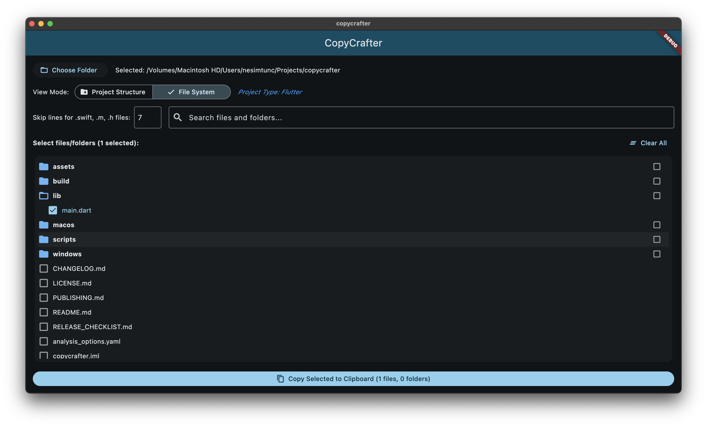

# CopyCrafter

A desktop application for macOS and Windows that helps browse folders and copy file contents to the clipboard, designed specifically for feeding code into LLMs without manual file-by-file copying.



## Features

- **Folder Selection**: Pick a folder to browse its contents
- **Tree View**: View all files and subfolders in a hierarchical tree structure
- **File & Folder Selection**: Select multiple files and folders using checkboxes
- **Clipboard Copy**: Copy the contents of all selected files and folders to clipboard
- **Save to File**: Export selected file contents to a text or markdown file
- **Token Count Estimation**: Real-time display of estimated token count for selected files (useful for LLM context limits)
- **Special File Handling**: Skip the first X lines from certain file types (e.g., copyright headers in .swift, .m, and .h files)
- **Smart Binary File Filtering**: Automatically excludes binary files (images, videos, audio, archives, executables, etc.)
- **Build Folder Exclusion**: Skips common build and dependency folders (build, node_modules, Pods, .gradle, bin, obj, etc.)
- **Search Functionality**: Quickly find files by name within your project with real-time filtering
- **Multi-Project Support**: Automatically detects and provides structured views for various project types:
  - **Xcode Projects**: View files in the same hierarchical structure as in Xcode
  - **.NET Projects**: Parse .csproj, .vbproj, and .sln files
  - **Android Projects**: Organize Android project files in a logical structure
  - **Flutter Projects**: Display Flutter project components in an organized way
- **Progress Tracking**: Visual progress dialog when selecting large folders with file-by-file status updates
- **Privacy-Focused**: Completely offline with no analytics or tracking

## Privacy

CopyCrafter is built with privacy as a core principle:

- **No Analytics**: The app does not include any analytics or tracking code
- **No Network Calls**: CopyCrafter operates completely offline and never makes any network requests
- **Fully Open Source**: All code is open source and can be audited for privacy
- **Local-Only Processing**: All operations are performed locally on your device

Your code and file information never leaves your computer unless you explicitly copy and paste it elsewhere.

## Getting Started

### Prerequisites

- Flutter SDK installed and configured for macOS desktop development
- Xcode (for macOS builds)
- Python 3 (for parsing project files)

### Installation

1. Clone the repository:
```bash
git clone https://github.com/nesimtunc/copycrafter.git
cd copycrafter
```

2. Install dependencies:
```bash
flutter pub get
```

3. Make the parsing scripts executable:
```bash
chmod +x scripts/parse_pbxproj.py
chmod +x scripts/parse_csproj.py
```

4. Run the app:
```bash
flutter run -d macos
```

### Building from Source

To build the application for your platform:

#### macOS
```bash
flutter build macos --release
```
The built app will be located at `build/macos/Build/Products/Release/CopyCrafter.app`

#### Windows
```bash
flutter build windows --release
```
The built app will be located at `build\windows\runner\Release\CopyCrafter.exe`

### Using the Build Script

You can use the included build script to build for all supported platforms:
```bash
./scripts/build_all.sh
```
This will create platform-specific installers in the `releases` directory.

### Downloading Releases

Pre-built releases are available on the [GitHub Releases page](https://github.com/nesimtunc/copycrafter/releases).

## Usage

1. Open the app and click "Choose Folder" to select a directory
2. If a supported project is detected, the app will automatically identify it and show its structure
   - Toggle between "Project Structure" view and "File System" view using the segmented button
3. Use the checkboxes to select files or folders you want to copy:
   - Click on a file's checkbox to select individual files
   - Click on a folder's checkbox to select the entire folder and all its contents (with progress tracking)
   - Long-press on a folder or use the folder checkbox to select/deselect folders
4. The app displays the estimated token count for your selection in real-time
5. Use the search box to quickly filter and find specific files or folders
6. Configure how many lines to skip for Swift/Objective-C files (default: 7)
7. Choose your preferred action:
   - Click "Copy to Clipboard" to copy the contents of all selected files
   - Click "Save to File" to export the contents to a .txt or .md file
8. Paste or use the exported contents wherever needed

## How It Works

### Project Detection
The app analyzes the selected directory and automatically identifies various project types:

1. **Xcode Projects**: Detects .xcodeproj directories and parses project.pbxproj files
2. **.NET Projects**: Finds .csproj, .vbproj, or .sln files and parses their structure
3. **Android Projects**: Identifies build.gradle files and AndroidManifest.xml
4. **Flutter Projects**: Recognizes pubspec.yaml with Flutter dependencies

### Smart File Processing
When folders are selected, the app:
1. Automatically excludes common build and dependency folders (build, node_modules, Pods, .gradle, bin, obj, DerivedData, etc.)
2. Filters out binary files (images, videos, audio, archives, executables, databases, fonts, etc.)
3. Recursively finds all text files within the selected folders
4. Shows a progress dialog with real-time status updates for large folder operations
5. Calculates token counts for each selected file
6. Processes each file according to its type (applying line skipping where needed)
7. Combines all content with file headers for organization

## Customization

- **Line Skipping**: The number of lines to skip for Swift (.swift) and Objective-C (.m, .h) files can be adjusted using the input field in the UI (useful for removing copyright headers)
- **Output Format**: Choose between copying to clipboard or saving to a .txt or .md file
- **View Modes**: Switch between Project Structure (organized by project type) and File System (raw directory structure) views
- **Token Estimation**: Built-in token counter uses a simple heuristic (approximately 4 characters per token) to estimate content size for LLM context limits

## License

This project is licensed under the MIT License - see the LICENSE file for details.

## About the Development

CopyCrafter was developed entirely using [Cursor](https://cursor.sh), a powerful AI-first code editor. The entire codebase was created through AI-assisted development with zero manual coding, demonstrating the power of modern AI pair programming.

## Contributing

Contributions are welcome! Feel free to submit issues or pull requests.
